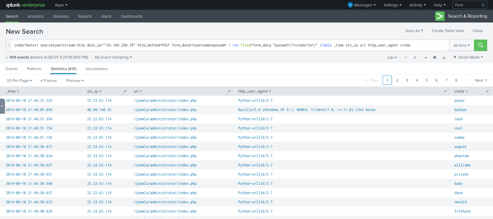
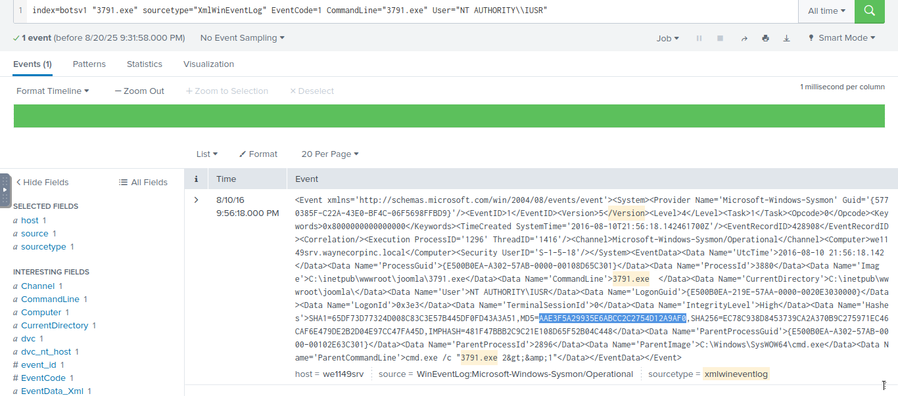
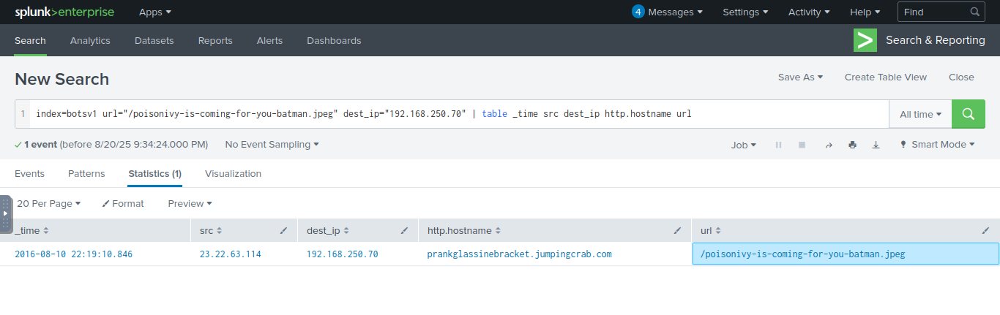
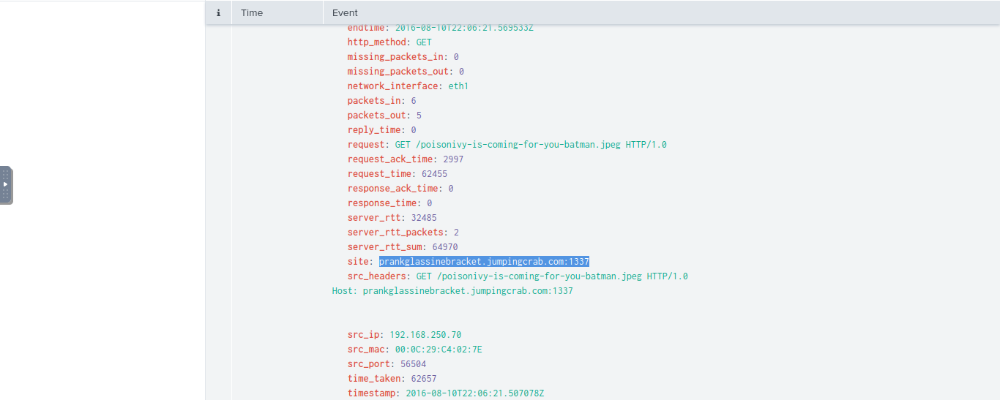

# Incident Handling with Splunk — Report

## Scenario
A Big corporate organization `Wayne Enterprises`  has recently faced a cyber attack where the attackers broke into their network, found their way to their web server, and have successfully defaced their website `http://www.imreallynotbatman.com`. Their website is now showing the trademark of the attackers with the message `YOUR SITE HAS BEEN DEFACED`.
During this exercise, we investigated the compromise of `imreallynotbatman.com` using Splunk and the `botsv1` dataset.  
The goal was to follow the full attack chain: initial access, execution, persistence, and command & control (C2).

---

## 1. Initial Access — Joomla Brute Force
We identified brute force attempts against the Joomla administrator login page.  
Using Splunk queries on HTTP POST requests, we extracted credentials and determined the successful login.

**Findings**  
- Targeted URL: `/joomla/administrator/index.php`  
- Successful credential: `batman`  
- Attacker IP and user-agent revealed automated brute force activity.  

 

---

## 2. Execution — Malicious Payload
After gaining access, the attacker uploaded and executed a malicious binary (`3791.exe`).  
Splunk event logs confirmed process creation on the victim host.

**Findings**  
- File executed: `3791.exe`  
- User context: `NT AUTHORITY\IUSR`  
- Hash MD5 was extracted to confirm integrity of the sample.  

 
 

---

## 3. Action on Objectives — Website Defacement
Further analysis revealed a defacement image downloaded to the server.  
HTTP logs showed access to `/poisonivy-is-coming-for-you-batman.jpeg`.

**Findings**  
- Defacement file hosted externally.  
- Traffic originated from the compromised web server.  

 

---

## 4. Command & Control — Dynamic DNS
The investigation uncovered communication with a suspicious dynamic DNS domain.  
This confirmed the presence of a C2 channel.

**Findings**  
- C2 FQDN: `prankglassinebracket.jumpingcrab.com`  
- Domain associated with the defacement activity.  

 

---

## Conclusion
This incident followed a classic cyber kill chain:  
1. Brute force login  
2. Payload execution  
3. Defacement of the target site  
4. C2 communication via dynamic DNS  

By using Splunk queries across multiple data sources (`http`, `XmlWinEventLog`, `suricata`, `fortigate_utm`), we were able to reconstruct the entire attack timeline.

---

**Made by: Xavier Mota**

**20/08/2025**
